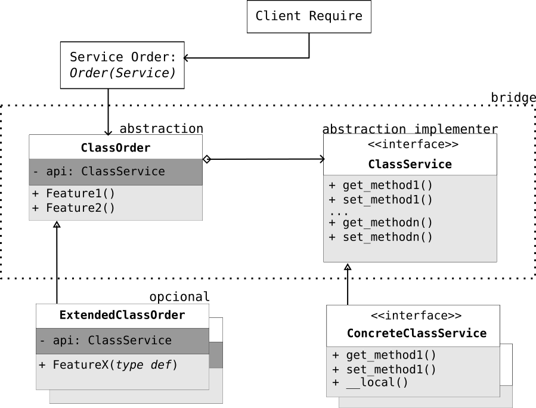

# Project Updates and Users Contributions

## Development Current Stages  

The main goal of this repository is to develop tests and configure a new version of the **myfempy** project (new version) based entirely on object-oriented programming (OOP).

This new version will allow for an expansion of the current **myfempy** version to high-performance computing (HPC), as well as a large data reading capacity, which is not currently possible due to its class complexity.

A future advancement will be to send data so that the solver executes the solution in parallel (multi-core) and also perform multi-physics analysis (Fluid-Structure interaction and Thermal-Structure interaction).

With the goal of keeping the project clean and clear throughout this development journey, the guidelines of Clean Architecture and the Bridge Design Pattern will be used for OOP code.

This new version allows the inclusion of modules and code written in C/Cython, as well as the possibility of using parallel processing for high-performance computing.

1. [ADDED] Study the characteristics of a FEM code with OOP

2. [ADDED] Extend the functionalities with OOP for the **myfempy** project

3. [ADDED] Generate a UML map of the classes in the code layers, making these maps available in the **User's Guide** documentation

4. [ADDED] Use the bridge design pattern to write the main classes of the system, as well as their feature() and method() functions

5. [ADDED] Develop an OOP code for the **myfempy** project

6. [ADDED] Develop an internal mesh generator using gmsh with .msh1 and .vtk mesh readers

7. [ADDED] Develop the output of results using .vtk files

8. [ ] Test the program to solve the multi-physics problem

9. [ADDED] Implementation of higher-order (quadritic) elements

10. [ADDED] Implementation of routines for multicore execution, e.g., Matrix assembly

11. [ADDED] Implement functionalities of the _myfempy/core_ code in C/Cython


Implement the following analysis solutions:

1. Solvers:

	1. Steady State Linear

		- [ADDED] Direct
		- [ADDED] Iterative
		- [ADDED] Eigen (Modal)
		- [ADDED] Harmonic (FRF)
		- [ ] Harmonic (Modal)

	2. Transient Response

		- [ ] Algo. Newmark

	3. Non-Linear

		- [ ] Algo. Newton-Raphson

	4. Advanced Analysis
		- [ADDED] Cyclic Symmetry
		- [ ] Axisymmetry
		- [ADDED] Phononic Crystal 2D (Plane Wave Elastic in Periodic Micro Cell)
		- [ADDED] Homogenized Elastic Tensor: Heterogeneous Material Micro Base Cell
		- [ ] Advanced Solvers: [PETSc](https://petsc.org/release/) and [SLEPc](https://slepc.upv.es/) packages

2. Mechanical Behavior of Materials:

	- [ADDED] Plane Stress
	- [ADDED] Plane Strain
	- [ADDED] Solid Elastic
	- [ADDED] Euler-Bernouilli Space Beam
	- [DEPRECATED] Timoshenko Space Beam
	- [ ] Plate Kirchhoff
	- [DEPRECATED] Plate Reissner-Mindlin
	- [ ] Large Displacements (Small Strains)
	- [ ] Linear Buckling
	- [ ] Plasticity (Nonlinear Stress-Strain Relation)
	- [ADDED] Heat Conduction
	- [ ] Incompressible Laminar Fluid Flow
	- [ ] Acustic Modal

3. Finite Elements Library:

	1. Shapes:
		- [ADDED] line2 - linha 2 nós
		- [ADDED] line3 - linha 3 nós
		- [ADDED] tria3 - triagular 3 nós
		- [ADDED] tria6 - triagular 6 nós
		- [ADDED] quad4 - quadrilateral 4 nós
		- [ADDED] quad8 - quadrilateral 8 nós
		- [ADDED] tetr4 - tetraedro 4 nós
		- [DEPRECATED] tetr10 - tetraedro 10 nós
		- [ADDED] hexa8 - hexaedro 8 nós
		- [DEPRECATED] hexa20 - hexaedro 20 nós

	2. Elements:
		- [ADDED] block - Spring + Mass 1D-space 1-node_dofs
		- [ADDED] structbeam - Beam Structural Element 1D-space 6-node_dofs
		- [ADDED] structplane - Plane Structural Element 2D-space 2-node_dofs
		- [ADDED] structsolid - Solid Structural Element 3D-space 3-node_dofs
		- [ADDED] heatplane - Plane Heat Element 2D-space 1-node_dof
		- [ADDED] heatsolid - Solid Heat Element 3D-space 1-node_dofs
		- [ ] flowplane - Plane Fluid/Flow Element 2D-space 1-node_dof
		- [ ] flowsolid - Solid Fluid/Flow Element 3D-space 1-node_dof
		- [ ] waveplane - Plane Acustic Element 2D-space 1-node_dof
		- [ADDED] userelement - User Defined Element API

4. Coupling:

	1. Multi-material

		- [ADDED] Multi Material Interface (multi E, v, ...)

	2. Multi-physical Analysis

		- [ADDED] Thermal-Structure interaction
		- [ ] Fluid-Structure interaction
		- [ ] Acoustic-Structure interaction

After the new implementation, a _merge_ was performed into the **myfempy_dev** repository (official repository for development and testing), and after passing all tests, it was uploaded to the project's main **myfempy** repository.

## Computational implementation of the project

For the computational design and implementation of the project, a clean architecture approach was adopted, combining layered components with the Bridge structural pattern in object-oriented programming. The layered architecture establishes a hierarchy of classes, while the Bridge pattern ensures flexible communication between them.

The project autonomously executes user commands through Python requests (structured as dictionaries). To clarify its functionality, the roles of each component are explained first, followed by an overview of their integration using the Bridge pattern.

Two primary classes were defined during development: the Order class (abstraction) and the Service class (implementor). The Order class provides its own API to interact with the Service class, thereby enabling communication with user requests.

Because the Order class is closed through its API, it can be extended to introduce new features. This extension is realized in the Extended Order class.

The Service class is responsible for executing commands. It contains both getter (return) and setter (configuration) methods. Direct user access to the Service class is restricted; interaction occurs only through the Order class interface.

Finally, the Service class itself serves as an abstraction. The actual implementations are delegated to the Concrete Service class, which performs the computations and delivers the required results. This completes the class arrangement employed in the project’s development.




As an example, let's look at a user request:

The client request is to calculate the stiffness matrix of a QUAD4 element. The process begins with the Order class, which receives the instruction: return the stiffness matrix of the element. This is executed through the method element.stiff(QUAD4.data) and passed via its API to the Service class. The Service class defines the abstract method get_stiff(), which does not contain any knowledge of the QUAD4 element’s data. Instead, the actual computation is performed by a concrete implementation of the Service class, which provides the method get_stiff_QUAD4(User.data). This method carries out the necessary calculations and produces the stiffness matrix as requested by the user. In summary, the Order class is responsible for initiating and guiding internal requests (via Features()), while delegating execution to the Service class interface. The concrete Service class then implements the specific methods (get_methods()) required to fulfill the client’s request.


For an overview, view the files during the project drafting phase.

[MYFEMPY Bridge Pattern Class Map [PDF]](assets/myfempy_class_map-class_object_map.pdf)

[MYFEMPY Layers of Project Draft [PDF]](assets/myfempy_layers.pdf)

For more details, see the object-oriented code bridge pattern
[Wiki Bridge pattern](https://en.wikipedia.org/wiki/Bridge_pattern)

## Users Contributions

Users are free to contribute to the project. If using MyFempy, please cite or contact the main author (see homepage). If you have suggestions, please open an [issue](https://github.com/avgcampos/myfempy/issues) on the project's main GitHub page; the author appreciates any feedback.

## General Styles Used in the Myfempy Project

**Rules for Uploading {*commit*} to the myfempy Project**

This repository is intended for managing the development versions of the **myfempy** project. To maintain clear and clean code, the following rules are applied to ensure a general project standard.

### Style of *.py* Codes

The syntax used for writing the code is [PEP8](https://peps.python.org/pep-0008).

### Class Creation Pattern *class AbcAbc*

```python

# the file name is abcabc.py

class AbcAbc: # class name

def __init__(self, x:int, y:float, z:str): # constructor method in python

# add parameter in class
self.x = x
self.y = y
self.z = z

```

### Function Creation Pattern *def abc_abc*

```python

# the file name is abcabc.py

def abc_abc(x:int, y:float): # function

sum_x = x + x

div_y = x/y

return div_y

```

### ```__doc__``` for classes and functions

Every class and function must contain its internal documentation {```__doc__```}.

Procedure

1. Use the reference [PEP8](https://peps.python.org/pep-0008)

2. Present in a single line what that class or function does

3. Use comments for additional information

4. All inputs and outputs and data types must be indicated

5. The default language is technical English

Example:

```python

# the file name is abcabc.py
# '__doc__' to a short documentation, try AbcAbc.__doc__ ....

__doc__ = """ This is a short documentation of class AbcAbc...
"""
class AbcAbc: # class name
"""
Abc: class

This class does...

"""

def __init__(self, x:int, y:float, z:str): # constructor method in python
"""
This class do...

Args:

x (int): int number

y (float): float number
z (str): string name

""

# add parameter in class
self.x = x
self.y = y
self.z = z

def abc_abc(self): # class function

""
This function do...

Returns:

div_y (float): _description_

""

soma_x = self.x + self.x

div_y = self.x/soma_x

return div_y

```

### Official Documentation

The standard used to write the official project documentation is in [Markdown](https://www.markdownguide.org/basic-syntax) format.

Currently, the project uses the [mkdocs](https://www.mkdocs.org/) package to generate online documentation {*.html*}, which is hosted on the [GitHub Page](https://avgcampos.github.io/myfempy/) website.s

*sphinx* converts *.rst* {reStructuredText} files to *.html/pdf* in a practical way. It is also possible to convert *.md* {markdown} files to *.rst*; an interesting option is [mdToRst](https://github.com/kata198/mdToRst) or online with [vertopal](https://www.vertopal.com/).

Procedure for updating the online documentation

1. To edit the official online project documentation, simply update the *.md* files in the **\docs** folder.

2. Check for **bugs** in the documentation.

3. Generate automatic documentation from the *mkdocs.yml* configuration file using the command:

```bash
>> mkdocs build # builds the files in \site

>> mkdocs gh-deploy # deploys to the hosting address on GitHub Pages
or
>> make doc # builds and generates local documentation
```


### Tests and bugs

Using line_profiler to check code performance, line by line

```python

@profile
def slow_function(a, b, c):

...

```

```bash

>> kernprof -l -v 'script_to_profile.py'

>> python -m line_profiler script_to_profile.py.lprof

```

Manual testes to verification before committing to _main_

Run in the project's main folder \myfempy

```bash

>> black script_name.py/<folder> # library that formats the code according to PEP 8

>> flake8 --extend-ignore=E501{line too long (82>79 characters) error} script_name.py/<folder> # framework that checks the style and quality of Python code

>> `isort script_name.py/<folder>` # Python library to automatically format imports according to PEP 8

`>> interrogate -vv script_name.py/<folder>` # framework to check for missing documentation (docstring) in the code.

```

These systems can also be checked automatically via *Makefile*. Do the following:

```bash
>> make install # installs the package in the development version [with requirements.txt file]

>> make format # checks the formatting with black and isort

>> make lint # checks the style (PEP 08) with flake8 and interrogate

>> make test # tests the package integration files with pytest

>> make sec # checks for vulnerabilities with pip-audit

>> make doc # build the web documentation version in the local server

```

### Local Git

Do the following:

```bash
git status # checks the system modifications

git add <file>... # to update what
```