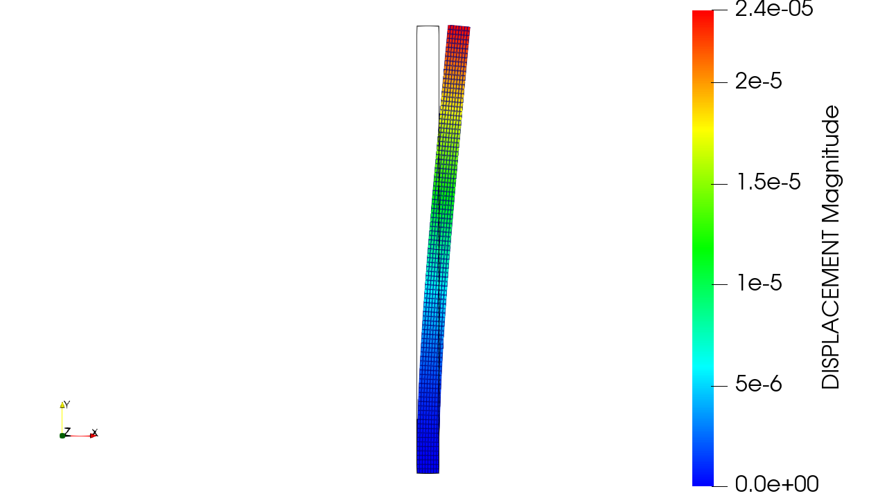
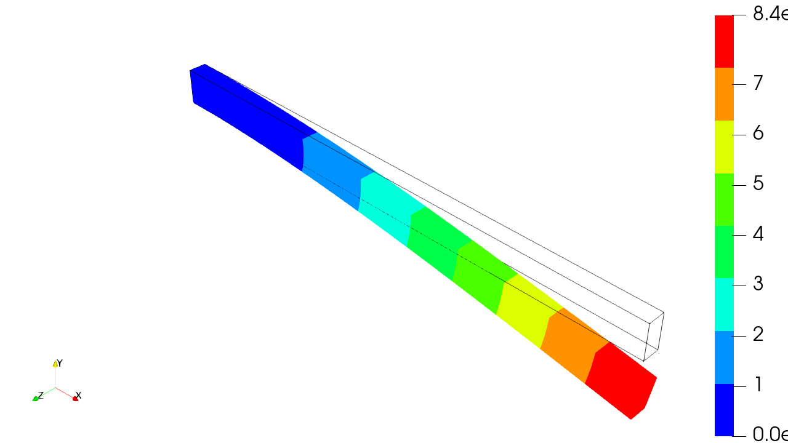
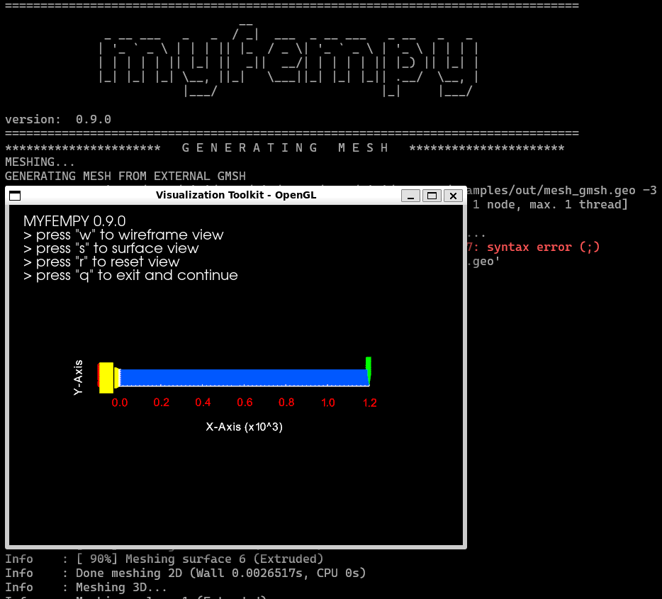
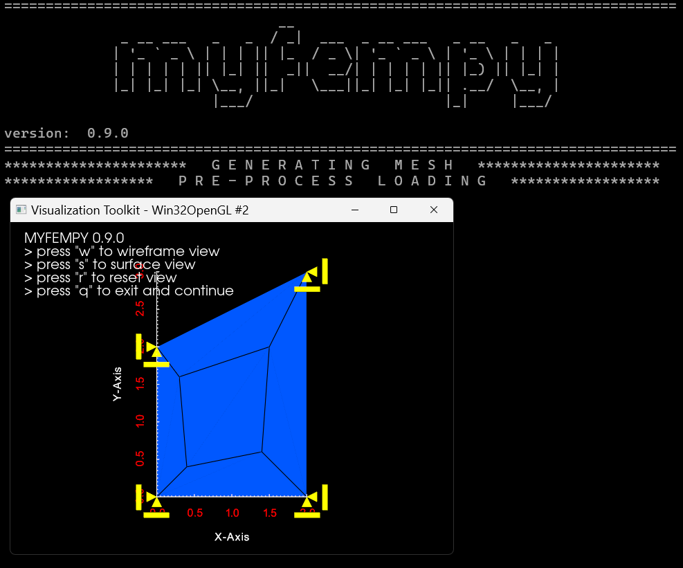
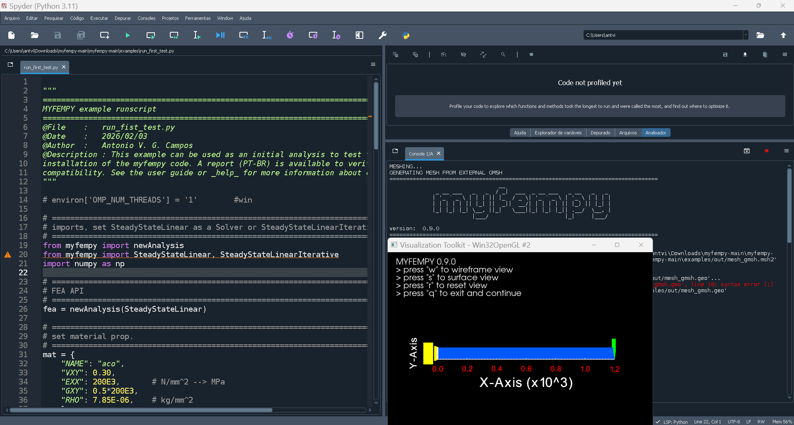
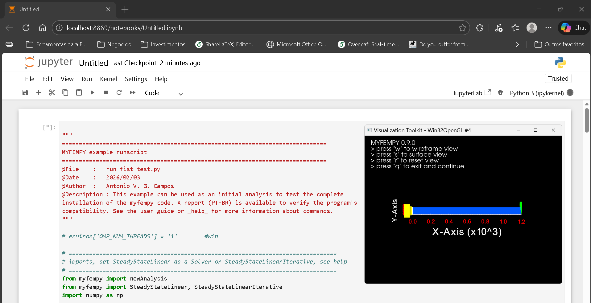
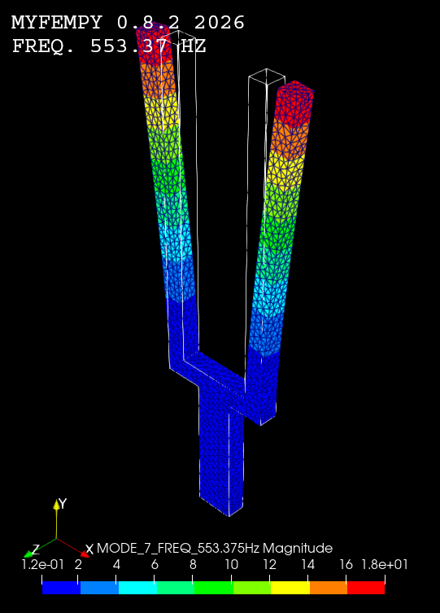
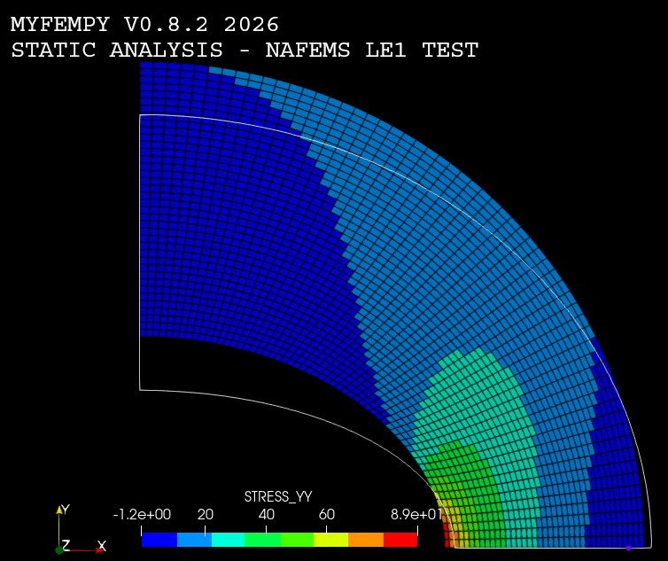
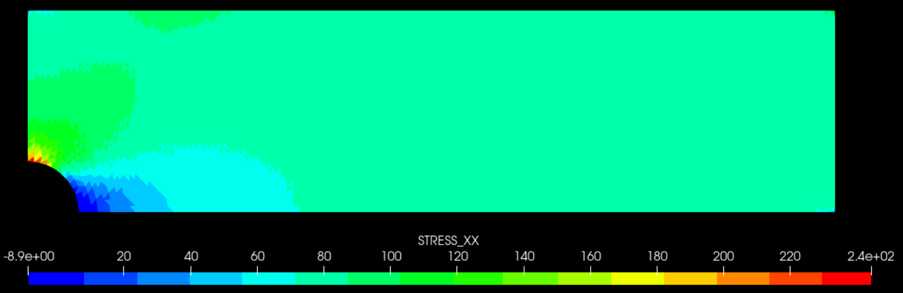
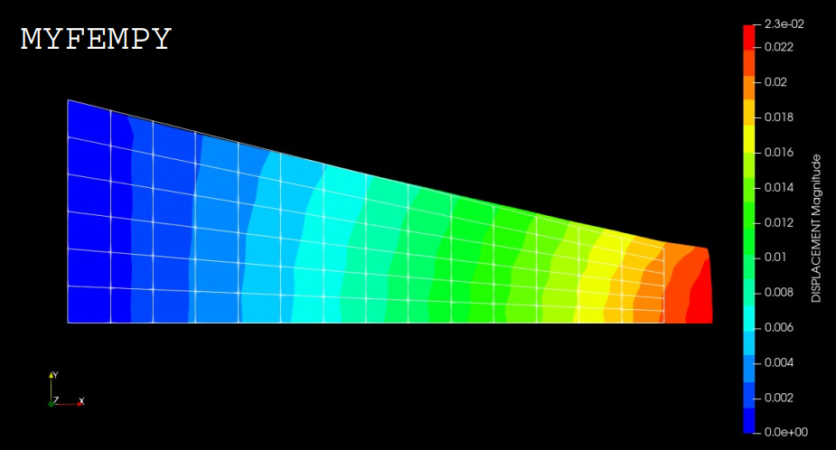

# Gallery

|  |  |
|----------|----------|
|  Static analysis to convergence of myfempy solver with su2 |  Fixed beam displacement result seen from Paraview |
|  Myfempy running in Ubuntu terminal (wsl2) |  Myfempy running in Windows 11 terminal (ps) |
|  Myfempy running in Spyder IDE from Anaconda Env. |  Myfempy running in Jupyter Notebook from Anaconda Env. |
|  Vibration analysis from a tuning fork |  Myfempy nafems test result |
|  Stress Concentration from Hole Plate |  Tapered Bar Displacemete Result |