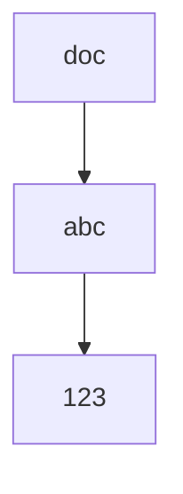

**Under Development**


## Welcome to myfempy's online documentation

Copyright © Antonio Vinicius G. Campos 2022. Processo INPI BR512022001484-0

## MathJax Test Page

When \(a \ne 0\), there are two solutions to \(ax^2 + bx + c = 0\) and they are

\begin{equation}
ax^2 + bx + c = 0
\end{equation}

$$ x = {-b \pm \sqrt{b^2-4ac} \over 2a} $$

## FlowChart with mermaid



## About

**Myfempy** is a python package based on finite element method for
scientific analysis. The code is open source and *intended for
educational and scientific purposes only, not recommended to commercial
use*. You can help us by contributing with a donation on the main
project page, read the support options. **If you use myfempy in your
research, the developers would be grateful if you could cite in your
work.**

## Installation

### To install myfempy manually in your directory, following the steps

1.  Clone/ Download the main code \[latest version\] from
    [github/myfempy/main](https://github.com/easycae-3d/myfempy/)
2.  Unzip the pack in your preferred location
3.  In the **myfempy-main** folder, open a terminal and enter with the
    command:

``` bash
>> python -m pip install --upgrade pip

>> pip install .

or

>> python -m pip install --upgrade build

>> python -m build
```

**Note: is recommend to create a virtual environment previously the
installation of** myfempy\*\* and dependencies packs. You can use the
[virtualenv](https://virtualenv.pypa.io/en/latest/) or [conda
environments](https://conda.io/projects/conda/en/latest/user-guide/tasks/manage-environments.html)\*\*

## Dependencies

**Myfempy** can be used in systems based on Linux, MacOS and Windows.
**Myfempy** requires Python 3.

### Installation prerequisites, required to build **myfempy**

You can use either of two python development environments to run myfempy

-   [Python 3.x](https://www.python.org/) - *Python is a programming
    language that lets you work quickly and integrate systems more
    effectively.*
-   [Anaconda](https://www.anaconda.com/) - *Anaconda offers the easiest
    way to perform Python/R data science and machine learning on a
    single machine.*

### Python packages required for using **myfempy**

The following python packages are required to run myfempy. Before to
install myfempy-main, install this packages. Check if they are already
installed on your machine

-   [numpy](https://numpy.org/) - The fundamental package for scientific
    computing with Python
-   [cython](https://cython.org/) - Cython is a language that makes
    writing C extensions for Python as easy as Python itself
-   [scipy](https://scipy.org/) - Fundamental algorithms for scientific
    computing in Python
-   [vedo](https://vedo.embl.es/) - A python module for scientific
    analysis and visualization of эd objects
-   [vtk](https://pypi.org/project/vtk/)(optional) - VTK is an
    open-source toolkit for 3D computer graphics, image processing, and
    visualization
-   try

``` bash
>> pip install numpy, cython, scipy, vedo
```

#### Outhers prerequisites

-   [gmsh/External Generator Mesh](https://gmsh.info/) - Gmsh is an open
    source 3D finite element mesh generator with a built-in CAD engine
    and post-processor. *Notes: 1 - Gmsh is NOT part of myfempy
    projects; 2 - Is Needed install Gmsh manually*
-   try

``` bash
>> pip install --upgrade gmsh
```

-   [gmsh PyPi](https://pypi.org/project/gmsh/)

## Tutorial

A **Basic Tutorial** is available
[here](https://myfempy.readthedocs.io/en/1.dev9/tutorial.html).

Many **Examples** are available
[here](https://github.com/easycae-3d/myfempy/tree/master/examples).

## Documentation

The myfempy is documented using Mkdocs under **docs**. The myfempy's
documents versions can be found in web version and pdf [link]().

## Release

The all release versions is available
[here](https://github.com/easycae-3d/myfempy/releases)

## Features

The *main myfempy features* are available here:

-   [Features
    List](https://github.com/easycae-3d/myfempy/blob/main/docs/Myfempy%20Features.pdf)

## License

**myfempy** is published under the [GPLv3
license](https://www.gnu.org/licenses/gpl-3.0.en.html). See the
[myfempy/LICENSE](https://github.com/easycae-3d/myfempy/blob/main/LICENSE.txt).

```{=html}
<!-- ## >> Acknowledgment -->
```
## Citing

Have you found this software useful for your research? Star the project
and cite it as:

-   APA:

``` bash
Antonio Vinicius Garcia Campos. (2022). myfempy (1.5.1). Zenodo. https://doi.org/10.5281/zenodo.6958796
```

-   BibTex:

``` bash
@software{antonio_vinicius_garcia_campos_2022_6958796,
author       = {Antonio Vinicius Garcia Campos},
title        = {myfempy},
month        = aug,
year         = 2022,
publisher    = {Zenodo},
version      = {1.5.1},
doi          = {10.5281/zenodo.6958796},
url          = {https://doi.org/10.5281/zenodo.6958796}
}
```

## References

-   [Myfempy](https://myfempy.readthedocs.io/) - *A python package for
    scientific analysis based on finite element method.*
-   [FEM](https://en.wikipedia.org/wiki/Finite_element_method) - *The
    finite element method (FEM) is a popular method for numerically
    solving differential equations arising in engineering and
    mathematical modeling.*
-   [Solid Mechanics](https://en.wikipedia.org/wiki/Solid_mechanics)
    -*Solid mechanics, also known as mechanics of solids, is the branch
    of continuum mechanics that studies the behavior of solid materials,
    especially their motion and deformation under the action of forces,
    temperature changes, phase changes, and other external or internal
    agents.*
-   [PDE](https://en.wikipedia.org/wiki/Partial_differential_equation)
    *In mathematics, a partial differential equation (PDE) is an
    equation which imposes relations between the various partial
    derivatives of a multivariable function.*

------------------------------------------------------------------------

## Changelog

The changelog is available
[here](https://github.com/easycae-3d/myfempy/wiki/Changelog)

# Project tree structure

``` bash
/myfempy
|   __about__.py
|   __init__.py
|
+---core
|   |   utilities.py
|   |   __init__.py
|   |
|   +---elements
|   |   |   acustic2DWP.py
|   |   |   beamEB.py
|   |   |   beamNL.py
|   |   |   element.py
|   |   |   fluid1DLF.py
|   |   |   fluid2DLF.py
|   |   |   heat2DSS.py
|   |   |   heat2DTR.py
|   |   |   plane.py
|   |   |   plateKC.py
|   |   |   solid.py
|   |   |   specials.py
|   |   |   __init__.py
|   |
|   +---geometry
|   |   |   geometry.py
|   |   |   rectangle.py
|   |   |   thickness.py
|   |   |   __init__.py
|   |
|   +---material
|   |   |   fluidplane.py
|   |   |   material.py
|   |   |   microscale.py
|   |   |   planestrain.py
|   |   |   planestress.py
|   |   |   solid.py
|   |   |   __init__.py
|   |
|   +---mesh
|   |   |   gmsh.py
|   |   |   legacyquad4.py
|   |   |   legacytria3.py
|   |   |   mesh.py
|   |   |   __init__.py
|   |
|   +---physic
|   |   |   acustic.py
|   |   |   bcstruct.py
|   |   |   coupling.py
|   |   |   fluidflow.py
|   |   |   loadstruct.py
|   |   |   structural.py
|   |   |   thermal.py
|   |
|   +---shapes
|   |   |   hexa20.py
|   |   |   hexa8.py
|   |   |   line.py
|   |   |   line2.py
|   |   |   line3.py
|   |   |   quad4.py
|   |   |   quad4_tasks.c
|   |   |   quad4_tasks.cp311-win_amd64.pyd
|   |   |   quad4_tasks.html
|   |   |   quad4_tasks.pyx
|   |   |   quad8.py
|   |   |   shape.py
|   |   |   tetr10.py
|   |   |   tetr4.py
|   |   |   tria3.py
|   |   |   tria3_tasks.c
|   |   |   tria3_tasks.cp311-win_amd64.pyd
|   |   |   tria3_tasks.html
|   |   |   tria3_tasks.pyx
|   |   |   tria6.py
|   |   |   __init__.py
|   |
|   +---solver
|   |   |   acustic.py
|   |   |   assembler.py
|   |   |   assemblerfull.py
|   |   |   assemblerfull_cython_v4.c
|   |   |   assemblerfull_cython_v4.cp311-win_amd64.pyd
|   |   |   assemblerfull_cython_v4.html
|   |   |   assemblerfull_cython_v4.pyx
|   |   |   assemblerfull_numpy_v1.py
|   |   |   assemblersymm.py
|   |   |   assemblersymm_cython_v4.c
|   |   |   assemblersymm_cython_v4.cp311-win_amd64.pyd
|   |   |   assemblersymm_cython_v4.html
|   |   |   assemblersymm_cython_v4.pyx
|   |   |   assemblersymm_numpy_v1.py
|   |   |   buckling.py
|   |   |   cyclicsymm.py
|   |   |   dynamic.py
|   |   |   fluid.py
|   |   |   harmoniclinear.py
|   |   |   harmonicmodal.py
|   |   |   modallinear.py
|   |   |   multiphysic.py
|   |   |   solver.py
|   |   |   staticlinear.py
|   |   |   staticlineariterative.py
|   |   |   staticnonlinear.py
|   |   |   thermal.py
|   |   |   __init__.py
|
|
+---io
|   |   iocsv.py
|   |   iogmsh.py
|   |   iovtk.py
|   |   __init__.py
|
+---plots
|   |   meshquality.py
|   |   physics.py
|   |   plotmesh.py
|   |   plotxy.py
|   |   postplot.py
|   |   prevplot.py
|   |   __init__.py
|
+---setup
|   |   asi.py
|   |   fea.py
|   |   fsi.py
|   |   model.py
|   |   physics.py
|   |   results.py
|   |   topopt.py
|   |   tsi.py
|   |   __init__.py
|
+---utils
|   |   logo.png
|   |   logo.txt
|   |   utils.py
|   |   __init__.py

```
