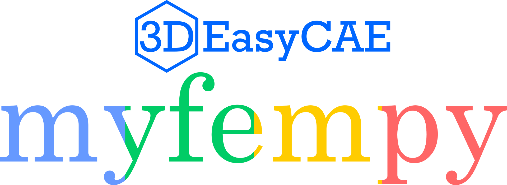

.. myfempy documentation master file, created by
   sphinx-quickstart on Mon Mar 14 21:53:28 2022.
   You can adapt this file completely to your liking, but it should at least
   contain the root `toctree` directive.
   
.. only:: html

**IN DEVELOPMENT !**

Welcome to myfempy's web documentation!
=======================================

Copyright © Antonio Vinicius G. Campos and 3D EasyCAE, 2022

About
=====

**Myfempy** is a python package based on finite element method for
scientific analysis. The code is open source and *intended for
educational and scientific purposes only, not recommended to commercial
use*. You can help us by contributing with a donation on the main
project page, read the support options. **If you use myfempy in your
research, the developers would be grateful if you could cite in your
work.**

Installation
============

To install myfempy manually in your directory, following the steps
------------------------------------------------------------------

1. Download the main code from
   `github/myfempy/main <https://github.com/easycae-3d/myfempy/tree/main>`__

2. Unzip the pack in your preferred location

3. In the **myfempy-main** folder, open a terminal and enter with the
   command:

.. code:: bash

   pip install .

*Note: is recommend to create a new virtual environment previously the
installation of*\ **myfempy**\ *and dependencies packs. You can use
the*\ `virtualenv <https://virtualenv.pypa.io/en/latest/>`__

Dependencies
============

**Myfempy** can be used in systems based on Linux, MacOS and Windows.
**Myfempy** requires Python 3.

Installation prerequisites, required to build **myfempy**:
----------------------------------------------------------

-  `Python 3.x <https://www.python.org/>`__ - *Python is a programming
   language that lets you work quickly and integrate systems more
   effectively.*
-  `Anaconda <https://www.anaconda.com/>`__ - *Anaconda offers the
   easiest way to perform Python/R data science and machine learning on
   a single machine.*

Outhers prerequisites
~~~~~~~~~~~~~~~~~~~~~

-  `Gmsh <https://gmsh.info/>`__ - Gmsh is an open source 3D finite
   element mesh generator with a built-in CAD engine and post-processor.
   *Note: needed install manually*

Python packages required for using **myfempy**:
-----------------------------------------------

-  `numpy <https://numpy.org/>`__ - The fundamental package for
   scientific computing with Python
-  `scipy <https://scipy.org/>`__ - Fundamental algorithms for
   scientific computing in Python
-  `vedo <https://vedo.embl.es/>`__ - A python module for scientific
   analysis and visualization of эd objects

.. code:: bash

   pip install numpy, scipy, vedo

Documentation
=============

The project is documented using Sphinx under ``docs/``. Built version
can be found from `Read the Docs <https://myfempy.readthedocs.io/>`__.
Here are direct links to additional resources:

The **GitHub/Download** page is available
`here <https://github.com/easycae-3d/myfempy/>`__.

The **User’s Manual [PT-BR]** is available
`here <https://github.com/easycae-3d/myfempy/blob/master/docs/Users_Manual_PT-BR.pdf>`__.

Many **examples** are available
`here <https://github.com/easycae-3d/myfempy/tree/master/examples>`__.

Release
=======

The version up to date is available
`here <https://github.com/easycae-3d/myfempy/releases>`__

Go to *Features List/Version History* to visualization all versions
releses.

Features
========

`Features
List <https://docs.google.com/spreadsheets/d/1k9kiXk2PPuUvcsiukAni005zQc-IOCmP2r-Z6B02304/edit?usp=sharing>`__

License
=======

**myfempy** is published under the `GPLv3
license <https://en.wikipedia.org/wiki/GNU_General_Public_License>`__

.. raw:: html

   <!-- ## >> Acknowledgment -->

Citing
======

Have you found this software useful for your research? Star the project
and cite it as:

-  APA:

   ::

      Antonio Vinicius Garcia Campos. (2022). easycae-3d/myfempy: beta (v1.0.1). Zenodo. https://doi.org/10.5281/zenodo.6376522

-  BibTex:

   .. code:: bash

       @software{Campos_easycae-3d_myfempy_beta_2022,
                author = {Antonio Vinicius Garcia Campos},
                title = {easycae-3d/myfempy: beta},
                version = {v1.0.1},
                url = {https://github.com/easycae-3d/myfempy/},
                doi = {10.5281/zenodo.6376522},
                month = {3},
                year = {2022}
                }

References
==========

-  `Myfempy <https://myfempy.readthedocs.io/>`__ - *A python package for
   scientific analysis based on finite element method.*

-  `FEM <https://en.wikipedia.org/wiki/Finite_element_method>`__ - *The
   finite element method (FEM) is a popular method for numerically
   solving differential equations arising in engineering and
   mathematical modeling.*

-  `Solid Mechanics <https://en.wikipedia.org/wiki/Solid_mechanics>`__ -
   *Solid mechanics, also known as mechanics of solids, is the branch of
   continuum mechanics that studies the behavior of solid materials,
   especially their motion and deformation under the action of forces,
   temperature changes, phase changes, and other external or internal
   agents.*

-  `PDE <https://en.wikipedia.org/wiki/Partial_differential_equation>`__
   - *In mathematics, a partial differential equation (PDE) is an
   equation which imposes relations between the various partial
   derivatives of a multivariable function.*

--------------

Changelog
=========

The changelog is available
`here <https://github.com/easycae-3d/myfempy/wiki>`__

--------------

Project tree structure
======================

.. code:: bash
   /myfempy
   |   version.py
   |   __init__.py
   |
   +---core
   |       assembler.py
   |       solver.py
   |       solverset.py
   |       staticlinear.py
   |       vibralinear.py
   |       __init__.py
   |
   +---felib
   |   |   crossec.py
   |   |   felemset.py
   |   |   materset.py
   |   |   physicset.py
   |   |   quadrature.py
   |   |   __init__.py
   |   |
   |   +---fluid
   |   |       __init__.py
   |   |
   |   +---fsi
   |   |       __init__.py
   |   |
   |   +---materials
   |   |       axial.py
   |   |       lumped.py
   |   |       planestrain.py
   |   |       planestress.py
   |   |       solid.py
   |   |       __init__.py
   |   |
   |   +---physics
   |   |       force2node.py
   |   |       getnode.py
   |   |       loadsconstr.py
   |   |       __init__.py
   |   |
   |   \---struct
   |           beam21.py
   |           frame21.py
   |           frame22.py
   |           plane31.py
   |           plane41.py
   |           solid41.py
   |           solid81.py
   |           spring21.py
   |           truss21.py
   |           __init__.py
   |
   +---io
   |       filters.py
   |       iomsh.py
   |       iovtk.py
   |       __init__.py
   |
   +---mesh
   |       genmesh.py
   |       gmsh.py
   |       legacy.py
   |       __init__.py
   |
   +---plots
   |       meshquality.py
   |       physics.py
   |       plotmesh.py
   |       plotxy.py
   |       postplot.py
   |       prevplot.py
   |       __init__.py
   |
   +---postprc
   |       displcalc.py
   |       postcomp.py
   |       postset.py
   |       __init__.py
   |
   \---tools
         logo.png
         logo.txt
         path.py
         tools.py
         __init__.py

.. Indices and tables
.. ==================

.. * :ref:`genindex`
.. * :ref:`modindex`
.. * :ref:`search`

.. toctree::
   :hidden:
   :maxdepth: 3
   
   Quick Start <self>
   tutorial
   documentation