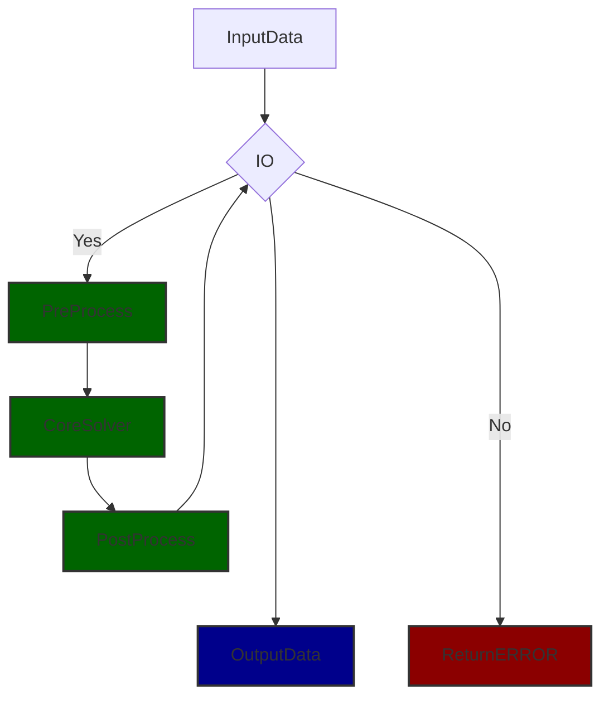
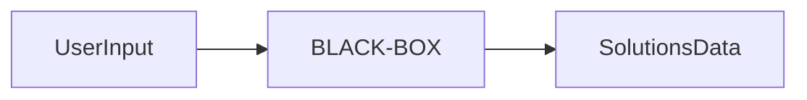
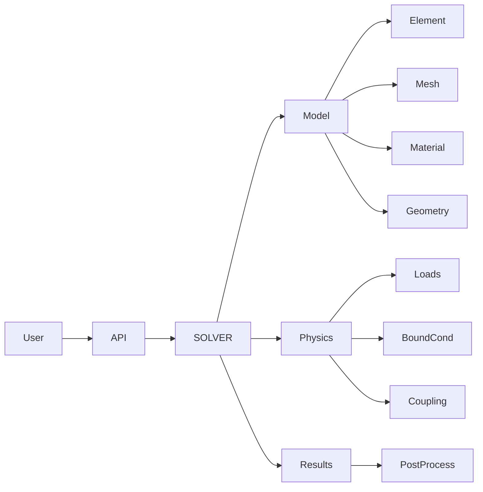

# User’s Guide

This guide introduces the components and commands that define the configuration file required to execute an analysis using **MYFEMPY**. Depending on the problem setup, adjustments may be necessary; please refer to the _help_ or _API_ documentation for details. Additional [Tutorials](#tutorials) are provided at the end of this guide.

## Presentation

The *myfempy* project was developed as a finite element solver for multi-physics simulations, intended for academic and research use. Originating from the author’s doctoral thesis, the project has matured into a robust computational framework. Its primary goal is to provide an accessible yet powerful environment for simulation setup and execution, minimizing the need for advanced prior knowledge of numerical methods while maintaining flexibility for expert users.

At its core, *myfempy* implements a finite element processor that drives the numerical analysis. The workflow is organized into three principal stages:

**Pre-processing**  
  - Configuration is performed through API commands.  
  - Users specify material properties, element types, and boundary conditions.  
  - Mesh generation is managed via **Gmsh**, which supplies both geometry and discretization data.

**Processing**  
  - The solver core executes finite element computations according to the defined physics and constraints.  
  - Multi-physics coupling is supported, enabling integration of multiple physical domains within a single simulation.

**Post-processing**  
  - Results are exported in formats compatible with visualization tools.  
  - Output data is structured as **VTK files**, which can be analyzed and visualized using **ParaView**.  

This architecture emphasizes modularity, extensibility, and interoperability with established open-source tools, positioning *myfempy* as a versatile platform for computational mechanics and multi-physics research.


To ensure organized execution, *myfempy* employs a hierarchical code structure that integrates user requests into a processing pipeline. Input data is validated through controllers in the I/O interface. If commands and data are consistent, they are passed to the solver core, where pre-processing, solution, and post-processing occur. The processed data is then returned through the I/O filters and exported as visualization-ready files (VTK).



## How it Works

*myfempy* is implemented using an object-oriented paradigm, structured around the **Bridge design pattern**. The system is composed of multiple classes, with user interaction facilitated through APIs that orchestrate the execution of the solver.

The project adopts a **black-box architecture**: users provide input data, the solver executes the numerical routines, and the system returns output data along with logs for validation.



A typical analysis workflow involves submitting requests (Python dictionaries) through a script. The user imports the desired solver, configures the problem by defining materials, finite elements, and geometry, and generates a mesh via Gmsh. Loads and boundary conditions are applied, and the solver computes the solution. Results are exported and visualized in ParaView.

The main API provides direct access to the core components of the project, enabling construction of the **Model**, definition of **Physics**, and execution of the **Solution**.

**Model Class**  
  - Element  
  - Shape  
  - Mesh  
  - Material  
  - Geometry  

**Physics Class**  
  - Loads  
  - Boundary Conditions  
  - Coupling (Multi-Physics)  

**Results Class**  
  - Post-processing and data export  



## Pre-Process

### API and Solver

```python
# ==============================================================================
# import newAnalysis to set a new problem
# ==============================================================================
from myfempy import newAnalysis
# ==============================================================================
# import a solver to running and analysis the problem set, e.g. SteadyStateLinear
# ==============================================================================
from myfempy import Solver
# ==============================================================================
# now, fea is the API to running the Solver Analysis
# ==============================================================================
fea = newAnalysis(Solver)
```

### Solvers

```python
# ==============================================================================
# currently available solvers for import into the myfempy library
# ==============================================================================
# solver options
"SteadyStateLinear"                 # Steady State Linear Solver Class
"SteadyStateLinearIterative"        # Steady State Linear Iterative Solver Class
"DynamicEigenLinear"                # Dynamic Eigen (modal problem) Linear Solver Class
"DynamicHarmonicResponseLinear"     # Dynamic Harmonic Response Forced System Steady State Linear Solver Class

# [adv]
"StaticLinearCyclicSymmPlane"       # Static Linear Cyclic Symmetry Plane Solver Class
"PhononicCrystalInPlane"            # Phononic Crystal In-Plane Solver Class
"HomogenPlane"                      # Homogenization Plane Solver Class
```

### Model

```python
# ==============================================================================
# modeldata is a Python dictionary that contains the commands for model set
# ==============================================================================
modeldata = dict()
```

#### Material

```python
# ==============================================================================
# config. material
# ==============================================================================
modeldata["MATERIAL"]: dict()
```
##### keys
```python
"MAT":str()		        # material set
# >see: Table ... to more informations
# options
'lumped' 			# lumped material
'uniaxialstress'	# axial{rod, beams...} behavior material
'planestress'		# plane stress behavior
'planestrain'		# plane strain behavior
'solidelastic'		# solid behavior material
'heatplane'			# heat behavior material
'heatsolid'			# heat behavior material

# [dev]
'fluid'

"TYPE":str()			# material behavior
# options
'isotropic'			# isotropic stress/strain material
'usermaterial'		# user config. material

"PROPMAT":list[mat_set_1:dict{},..., mat_set_n:dict{}] # material properties
"NAME": str() 		# material name def
# isotropic solid parameters
# >see: Appendix: Table 3 - Consistent Units to more informations
"EXX": float()		# elasticity modulus in x direction 
"VXY": float() 		# poisson's ratio in x direction  
"GXY": float()		# shear modulus in x direction	
"RHO": float() 		# density of material

# anisotropic solid parameters
"EYY": float()
"VYZ": float()
"GYZ": float()
"EZZ": float()
"VZX": float()
"GZX": float()

# heat parameters
"KXX": float()      # thermal conductivity in x direction
"KYY": float()      # thermal conductivity in y direction
"KZZ": float()      # thermal conductivity in z direction
"CTE": float()      # coefficients thermal expansion

# [dev] fluid parameters 
"VIS": float()      # viscosity            
"RHO": float() 		# density of fluid

# lumped model
"STIF": float()		# stiffness lumped
"DAMP": float()		# damping lumped
```

#### Geometry

```python
# ==============================================================================
# config. geometry
# ==============================================================================
modeldata["GEOMETRY"]: dict()
```
##### keys
```python
"GEO":str()		        # geometry type
# options
'solid' 			# solid 3D geo.
'thickness'	        # planes geometries, e.g. plane stress, plates ...
'frame'		        # rods, beams and frames geometries 

"SECTION":str()         # geometry beam cross section set
# options
# >see: Table ... to more informations
'rectangle' 			
'rectangle_tube'	       
'circle'	
'circle_tube'
'isection'
'tsection'
'csection'
'lsection'
'userdefined'	        

"PROPGEO":list[mat_set_1:dict{},..., mat_set_n:dict{}] # geometry properties
# parameters
"NAME": str() 		# geometry name def
# >see: Appendix: Cross Section Dimensions to more informations
"DIM":dict()		# dimensional beam cross section
{
    "b":float()		# b size
    "h":float()		# h size
    "t":float()		# t size
    "d":float()     # d size
}

"CG":dict()         # center of gravity of beam cross section
{
    "y_max":float(),
    "y_min":float(),
    "z_max":float(),
    "z_min":float(),
    "r_max":float()
}			

# parameters defined for the user's cross-section
"AREACS": float()	# area cross section
"INERXX":float()	# inercia x diretion 
"INERYY":float()	# inercia y diretion 
"INERZZ":float()	# inercia z diretion 
"THICKN":float()	# thickness of plane/plate
```


#### Element

```python
# ==============================================================================
# config. element
# ==============================================================================
modeldata["ELEMENT"]: dict()
```
##### keys
```python
"TYPE": str()			# finite element 
# options
# >see: Table 1 - Elements List to more informations
'structbeam'		# Beam Structural
'structplane'		# Plane Structural
'structsolid'       # Solid Structural
'heatplane'         # Plane Heat
'heatsolid'         # Solid Heat

# [dev]
'structplate'       
'fluid2d'        
'fluid3d'

'SHAPE': str()
# options
# >see: Table 2 - Mesh List to more informations
'line2'             # Line 2-Node
'line3'             # Line 3-Node
'tria3'             # Triangular 3-Node
'tria6'             # Triangular 6-Node
'quad4'             # Quadrilateral 4-Node
'quad8'             # Quadrilateral 8-Node
'hexa8'             # Hexaedron 8-Node
'tetr4'             # Tetrahedron 4-Node
'usershape'         # User Defined Shape

'INTGAUSS': int() 		# number of points to integrations the mesh
# options
# >see: Table 2 - Mesh List to more informations

```

#### Mesh

```python
# ==============================================================================
# config. mesh
# ==============================================================================
modeldata["MESH"]: dict()
```

##### Manual Mesh Options
```python
'TYPE': 'manual'
'COORD': nodes_coord_array
# [
# [node_number_1:int, coord_x_node_1:float, coord_y_node_1:float, coord_z_node_1:float]
# ...
# [node_number_N:int, coord_x_node_N:float, coord_y_node_N:float, coord_z_node_N:float]
# ]
# example:
# >>nodes_coord_array =
# [
# [1, 0, 0, 0]
# [2, 1, 0, 0]
# [3, 0, 1, 0]
# ]
'INCI': mesh_incidence_array
# [
# [elem_number_n:int, elem_type:int, mat_type:int, geo_type:int, nodes_list_conec_1,...nodes_list_conec_n]
# ...
# ]
# example:
# >>mesh_incidence_array =
# [[1, 1, 1, 1, 2, 3, 4]]
```

##### Legacy Mesh Options

```python
'TYPE': 'legacy'
# parameters
'LX': float()			    # set a length in x diretion
'LY': float()			    # set a length in y diretion
'NX': int()				    # set a number of elements in x diretion	
'NY': int()				    # set a number of elements in y diretion
```

##### Gmsh Mesh Options [adv]

```python
'TYPE': 'gmsh',

# parameters
'filename':str()					# name of files exit
'meshimport':dict{}					# opt. to import a external gmsh mesh
# option
'object':str(object name [.msh2]) # file .msh2 only, legacy mesh from gmsh [current version]

'cadimport':dict{}					# opt. to import a cad model from any cad program
# option                                                                                      
'object':str(object name [.step]) # file .step/.stp only [current version]

# Options to build a self model in .geo file (from gmsh)
'pointlist': list[]					# poinst coord. list
# set
# [
# [coord_x_point_1:float, coord_y_point_1:float, coord_z_point_1:float]
# ...
# ]

#  y
#  |
#  |
# (1)----x
#   \
#    \
#     z

# example
# points = [
#     [0, 0, 0],
#     [10, 0, 0],
#     [10, 20, 0],
#     [0, 20, 0]
# ]

'linelist': list[]                # lines points conec., counterclockwise count			
# set
# [
# [point_i_line_1:int, point_j_line_1:int]
# ...
# ]

# (i)-----{1}-----(j)

# example
# lines = [
#   [1, 2],
#   [2, 3],
#   [3, 4],
#   [4, 1],
# ]

'planelist': list[]				# planes lines conec., counterclockwise count
# set														  
# [                                                         
# [line_1_plane_1:int, ..., line_n_plane_1:int]             
# ...                                                               
# ]				

# (l)-----{3}-----(k)
#  |               |
#  |               |
# {4}     [1]     {2}
#  |               |
#  |               |
# (i)-----{1}-----(j)

# example
# plane = [[1, 2, 3, 4]]
    
'circle':list[]					# circle line, counterclockwise count
# set
# [
# [R,[CX,CY,CZ],[A0, A1]] # arc_1
# ...
# ]

#       A1    ^
#       |    /
#       |   /
#       |  R
#       | /
#       |/
# (i:CX,CY,CZ)------A0

# options
R:float()    					# circle radius
CX:float()   					# point i center x coord.
CY:float()   					# point i center y coord.
CZ:float()   					# point i center z coord.
A0:str(e.g. val.='0')	  		# angle begin [rad]
A1:str(e.g. val.='Pi/2')     	# angle end [rad]

# example:
# circle = [[30, [100, 100, 0], ['0', '2*Pi']]

'arc': list[]                   # arc 3 points needed
# set
# [
# [point_i_begin:int, point_j_midle:int, , point_k_end:int]
# ...
# ]

# example:
# points = [
#     [0, 0, 0],    # ponto 1
#     [200, 0, 0],  # ponto 2
#     [200, 40, 0], # ponto 3   
#     [100, 40, 0], # ponto 4
#     [90, 30, 0],  # ponto 5
#     [0, 30, 0],   # ponto 6
#     [90, 40, 0],  # ponto 7
# ]
# lines = [
#     [1, 2],       # linha 1
#     [2, 3],       # linha 2
#     [3, 4],       # linha 3
#     [5, 6],       # linha 4
#     [6, 1],       # linha 5
#          ]
# arcs = [
#     [5, 7, 4],    # arco linha 7
#          ]
# plane = [
#     [1, 2, 3, 6, 4, 5], # plane 1
#          ]

'meshconfig':dict{}			    # mesh configuration inputs
# options
'mesh': str()					# set a type of mesh used in analysis
'sizeelement':float()			# size min. of elements
'numbernodes':int()				# select a number of nodes in line, only to 'line2/ line3' >see: Table 2 - Mesh List to more informations
'extrude':float()				# extrude dimensional, in z diretion, from a xy plane
'meshmap':dict{}				# gen. a mapped structured mesh
# option
'on':bool()				        # turn on(true/ false)
True
False
'edge': [                       # select edge(lines) to map (only in 'on':True)			
'all' or TAGS NUMB:list[int()]	# select all edge or a specific edge
]
'numbernodes':list[int()]	    # select a number of nodes in edge
# example:
# 'meshmap': {'on': True,
#     'edge': [[1, 2, 3], [4, 5, 6, 7]] or 'all',
#     "numbernodes": [12, 8],
```

```python
# ==============================================================================
# Finally, pass the modeldata to the Model constructor API with the configured data and commands.
# ==============================================================================
fea.Model(modeldata)
```


### Physics Setting

```python
# ==============================================================================
# physicdata is a Python dictionary that contains the commands for physics set
# ==============================================================================
physicdata = dict()
```

```python
# ==============================================================================
# physic set
# ==============================================================================
physicdata["PHYSIC"] = dict()
```

#### Domain

```python
# ==============================================================================
# set the domain
# ==============================================================================
physicdata["PHYSIC"]["DOMAIN"]: str()
# options
'structural'
'thermal'

# [dev]
'fluid'
```

#### Loads
```python
# ==============================================================================
# configuration of loads applied to physics
# ==============================================================================
physicdata["PHYSIC"]["LOAD"]: list[]
```

##### keys
```python
"DEF":str() 		        # type force n def.
# options
'forcenode'					# force in nodes, concentrated load
'forceedge'					# force in edge, distributed load
'forcebeam'					# force in beam only opt., distributed load [legacy version]
'forcesurf'					# force in surface, distributed load

# [adv]
'forcebody'
'strainzero'

# heat options
'heatfluxedge'
'heatfluxsurf'
'convectionedge'
'convectionsurf'
'heatgeneration'

"DOF":str()				    # dof direction of force n
# options
'fx'						# force in x dir.
'fy'						# force in y dir.
'fz'						# force in z dir.
'tx'						# torque/moment in x dir.
'ty'						# torque/moment in y dir.
'tz'						# torque/moment in z dir.
'masspoint'					# mass concentrated applied in node/point 
'spring2ground'				# spring connected node to ground/fixed end
'damper2ground'				# damper connected node to ground/fixed end

# ----- OPT. WITH LOC SEEKERS 

"DIR":str()				    # set direction >see: Axis Diretions
# options
'node'						# node in mesh
'lengthx'					# length line in x dir., beam only option [legacy version]
'lengthy'					# length line in y dir., beam only option [legacy version]
'lengthz'					# length line in z dir., beam only option [legacy version]
'edgex'						# edge def in x dir. >'LOC': {'x':float(coord. x nodes), 'y':999(select all node in y dir.), 'z':float(coord. z nodes)}
'edgey'						# edge def in y dir.
'edgez'						# edge def in z dir.
'surfxy'					# surf def in xy plane >'LOC': {'x':999, 'y': 999, 'z':float(coord. z nodes)}
'surfyz'					# surf def in yz plane
'surfzx'					# surf def in zx plane

"LOC":dict()				# coord. node locator >see: Axis Diretions
'x':float()				        # x coord. node
'y':float()				        # y coord. node
'z':float()                     # z coord. node

# ----- OPT. WITH TAG SEEKERS

"DIR":str()				    # set direction >see: Axis Diretions
# options
'point'						# point number in tag list
'edge'						# edge number in tag list
'surf'						# surface number in tag list
		
"TAG":int()					# tag number of regions type, used with gmsh mesh gen, view list

"VAL":list()				# value list of force on steps, signal +/- is the direction
```

#### Boundary Conditions

```python
# ==============================================================================
# configuration of boundary conditions applied to physics
# ==============================================================================
physicdata["PHYSIC"]["BOUNDCOND"]: list[]
```

##### keys
```python
"DEF":str() 		            # type force n def.
# options
'fixed'							# fixed boundary condition u=0. More in 
'displ'							# displ boundary condition u!=0.

# [adv]
'cycsym'
'bloch'

# heat options
'insulated'
'temperature'

"DOF":str()				        # dof direction of force n
# options
'ux'							# force in x dir.
'uy'							# force in y dir.
'uz'							# force in z dir.
'rx'							# torque/moment in x dir.
'ry'							# torque/moment in y dir.
'rz'							# torque/moment in z dir.
'full'							# mass concentrated applied in node/point 

# ----- OPT. WITH LOC SEEKERS 

"DIR":str()				        # set direction >see: Axis Diretions
# options
'node'							# node in mesh
'edgex'							# edge def in x dir. >'LOC': {'x':float(coord. x nodes), 'y':999(select all node in y dir.), 'z':float(coord. z nodes)}
'edgey'							# edge def in y dir.
'edgez'							# edge def in z dir.
'surfxy'						# surf def in xy plane >'LOC': {'x':999, 'y': 999, 'z':float(coord. z nodes)}
'surfyz'						# surf def in yz plane
'surfzx'						# surf def in zx plane

"LOC":dict()
# options					# coord. node locator >see: Axis Diretions
'x':float()				        # x coord. node
'y':float()				        # y coord. node
'z':float()                     # z coord. node

# ----- OPT. WITH TAG SEEKERS

"DIR":str()				        # set direction >see: Axis Diretions
# options
'point'							# point number in tag list
'edge'							# edge number in tag list
'surf'							# surface number in tag list
	
"TAG":int()						# tag number of regions type, used with gmsh mesh gen, view list

"VAL":list()				    # value list of dislp on steps
```

#### Coupling

```python
# ==============================================================================
# configuration of coupling applied to physics
# ==============================================================================
physicdata["COUPLING"] = dict()
```

##### keys
```python
"TYPE": 'thermalstress', # fsi asi
"POST": [postprocdata]
```

```python
# ==============================================================================
# Finally, pass the physicdata to the Physic constructor API with the configured data and commands
# ==============================================================================
fea.Physic(physicdata)
```

## Preview analysis

```py
# ==============================================================================
# Preview set
# ==============================================================================
previewset = {'RENDER': 
{
'filename': str(),

'show': bool()
# options
    True
    False

'scale': int(),

'savepng': bool(),
# options
    True
    False

'lines': bool(),   # wireframe lines
# options
    True
    False

'plottags': {
# options
    'point': True/ False
    'line':  True/ False
    'surf':  True/ False
}

# beam cross-section view optinos
'cs': True,    
},
}
fea.PreviewAnalysis(previewset)
```

## Solver Set

```python
# ==============================================================================
# ==============================================================================
solverset = {"STEPSET": 
{
'type': str()
    # options
    'table',
    'mode',
    'freq',
    'time',
'start': int(),   
'end': int(),
'step': int(),
    },

'SYMM': bool(),  # matrix symmetric assembler
# options
    True
    False

# [dev]
'MP': bool(),    # multi processing 
# options
    True
    False
}
solverdata = fea.Solve(solverset)
```

## Post-Process

```python
# ==============================================================================
# ==============================================================================
postprocset = {
"SOLVERDATA": solverdata,

"COMPUTER": {
'structural': {
    'displ': True/ False, 
    'stress': True/ False}

'thermal': {
    'temp': True/ False,
    'heatflux': True/ False}

# [dev]
'fluid',
},

"PLOTSET": {
'show': True/ False, 
'filename': str(), 
'savepng': True/ False},

"OUTPUT": {
'log': True/ False, 
'get':{
    'nelem': True/ False,
    'nnode': True/ False,
    'inci': True/ False,
    'coord':True/ False,
    'tabmat':True/ False,
    'tabgeo':True/ False,
    'boundcond_list':True/ False,
    'forces_list':True/ False,
}
}}
postprocdata = fea.PostProcess(postprocset)
```

## Tutorials

### Mesh

#### Manual Mesh
```python
--8<-- "docs/tutoriais/malha/manual_mesh_gen.py"
```

#### Legacy Mesh
```python
--8<-- "docs/tutoriais/malha/legacy_mesh_gen.py"
```

#### GMSH Mesh Basic
```python
--8<-- "docs/tutoriais/malha/gmsh_basic_comm.py"
```

#### GMSH Mesh Advanced
```python
--8<-- "docs/tutoriais/malha/gmsh_adv_comm.py"
```

#### GMSH Mesh Solids
```python
--8<-- "docs/tutoriais/malha/gmsh_solid_comm.py"
```

#### GMSH Mesh Importing CAD models (.stp/.step)
```python
--8<-- "docs/tutoriais/malha/gmsh_cad_comm.py"
```

#### GMSH Mesh Importing mesh files (.msh2)
```python
--8<-- "docs/tutoriais/malha/gmsh_msh2_comm.py"
```

### Material set

#### Set Isotropic Mat.
```python
--8<-- "docs/tutoriais/material/set_isotropic_material.py"
```

#### Set User Material
```python
--8<-- "docs/tutoriais/material/set_user_material.py"
```

### Loads and Boundary Conditions

#### Structural
```python
--8<-- "docs/tutoriais/forcas_boundcond/set_strucutural_model.py"
```

#### Gmsh API
```python
--8<-- "docs/tutoriais/forcas_boundcond/set_gmsh_api_model.py"
```

#### Heat
```python
--8<-- "docs/tutoriais/forcas_boundcond/set_heat_model.py"
```

### Solve and Post-Process

#### Structural Static 
```python
--8<-- "docs/tutoriais/analise_pos/static_struct.py"
```

#### Structural Vibration
```python
--8<-- "docs/tutoriais/analise_pos/vibration_struct.py"
```

#### Heat
```python
--8<-- "docs/tutoriais/analise_pos/heat.py"
```

#### Thermo Mechanical Coupling
```python
--8<-- "docs/tutoriais/analise_pos/tmc.py"
```

## Appendix

### Useful Links

[GMSH](https://pypi.org/project/gmsh/)

[FreeCAD](https://www.freecad.org/index.php?lang=pt_BR)

[Python](https://www.python.org/)

[NumPy](https://numpy.org/)

[SciPy](https://scipy.org/pt/)

[Computer-aided design](https://en.wikipedia.org/wiki/Computer-aided_design)

[Finite element method](https://en.wikipedia.org/wiki/Finite_element_method)

[Young's modulus](https://en.wikipedia.org/wiki/Young%27s_modulus)

[Poisson's ratio](https://en.wikipedia.org/wiki/Poisson%27s_ratio)

[Shear modulus](https://en.wikipedia.org/wiki/Shear_modulus)

[Density](https://en.wikipedia.org/wiki/Density)

[List of moments of inertia](https://en.wikipedia.org/wiki/List_of_moments_of_inertia)

[Boundary value problem](https://en.wikipedia.org/wiki/Boundary_value_problem)

[Gaussian quadrature](https://en.wikipedia.org/wiki/Gaussian_quadrature)

[International System of Units](https://en.wikipedia.org/wiki/International_System_of_Units)

### Table 1 - Elements List

| element       | id    | description                                               |
|---------------|-------|-----------------------------------------------------------|
| 'block'       | 11    | Spring + Mass 1D-space 1-node_dofs                        |
| 'structbeam'  | 16    | Beam Structural Element 1D-space 6-node_dofs              |
| 'structplane' | 22    | Plane Structural Element 2D-space 2-node_dofs             |
| 'structsolid' | 33    | Solid Structural Element 3D-space 3-node_dofs             |
| 'heatplane'   | 21    | Plane Heat Element 2D-space 1-node_dof                    |
| 'heatsolid'   | 31    | Solid Heat Element 3D-space 1-node_dofs                   |
| 'userelement' | 99    | User Defined Element API                                  |
|               |       |                                                           |

### Table 2 - Mesh List

| mesh    | id    | description                                               |
|---------|-------|-----------------------------------------------------------|
| "line2" | 21    | Line 2-Node Shape 2-nodes_conec 1-interpol_order          |
| "line3" | 32    | Line 3-Node Shape 3-nodes_conec 2-interpol_order          |
| "tria3" | 31    | Triangular 3-Node Shape 3-nodes_conec 1-interpol_order    |
| "tria6" | 62    | Triangular 6-Node Shape 6-nodes_conec 2-interpol_order    |
| "quad4" | 41    | Quadrilateral 4-Node Shape 4-nodes_conec 1-interpol_orde  |
| "quad8" | 82    | Quadrilateral 8-Node Shape 8-nodes_conec 2-interpol_order |
| "hexa8" | 81    | Hexaedron 8-Node Shape 8-nodes_conec 1-interpol_order     |
| "tetr4" | 41    | Tetrahedron 4-Node Shape 4-nodes_conec 1-interpol_orde    |
|         |       |                                                           |

### Table 3 - Consistent Units

| Quantity | SI(m)    | SI(mm)      |
|----------|----------|-------------|
| length   | m        | mm          |
| force    | N        | N           |
| mass     | g        | kg          |
| time     | s        | s           |
| stress   | Pa(N/m^2)| MPa(N/mm^2) |
| energy   | J        | mJ(J E-3)   |
| density  | kg/m^3   | kg/mm^3(kg/m^3 E-9)|
|          |          |             |

### Axis Diretions

```python
# 		 |
# 		 [Y]
# 		 |		P1 -- principal plane
# 		 |		P2 -- secondary plane
# 		 |__edgey__
# 	    /|		   |
# 	   / |   P1    |
# 	  /	 | surfxy  edgex
# 	 /  f|		   |
#   /  r |_________|____________[X]__
#  | u  /          /
#  |s z/   P2     /
#  | y/	 surfzx  edgez
#  | /          /
#  |/__________/		
#  /		 
# [Z]
#/

```

### Cross Section Dimensions

[Geometric Cross-Section Libraries](assets/cross_sections_set.svg)

```python
# 						:
# 						[Y]
# 						:
#  ___		 ___________:___________
# 	| 		|_______    :    _______|	
# 	|				|	:	|
# 	|			 -->|	:	|<-------------(t)
# 	|				|	:	|
# 	|				|	:	|
# 	|				|	:	|
#   (h)				|  (CG).|..........[Z]..
# 	|				|		|
# 	|				|		|
# 	|				|		|
# 	|				|		|
# 	|		 _______|		|_______	___	 
#  _|_		|_______________________|  	_|_(d)
                                    
                                    
# 			|-----------(b)---------|						
```

### Tag Legends

* [ adv ]: Inputs advanced options or external package
* [ dev ]: Inputs options in development (next update)
* [ old ]: Inputs of legacy/old version

------------------------------------------------------------------------

## Project tree structure

``` bash
/myfempy
|   __init__.py
|
+---core
|   |   utilities.py
|   |
|   +---elements
|   |   |   element.py
|   |   |   heatPlane.py
|   |   |   heatSolid.py
|   |   |   structBeam.py
|   |   |   structPlane.py
|   |
|   +---geometry
|   |   |   circle.py
|   |   |   circle_tube.py
|   |   |   csection.py
|   |   |   geometry.py
|   |   |   isection.py
|   |   |   lsection.py
|   |   |   rectangle.py
|   |   |   rectangle_tube.py
|   |   |   thickness.py
|   |   |   tsection.py
|   |   |   userdefined.py
|   |
|   +---material
|   |   |   heatplane.py
|   |   |   heatsolid.py
|   |   |   material.py
|   |   |   planestrain.py
|   |   |   planestress.py
|   |   |   solidelastic.py
|   |   |   uniaxialstress.py
|   |
|   +---mesh
|   |   |   gmsh.py
|   |   |   legacyline2.py
|   |   |   legacyquad4.py
|   |   |   legacytria3.py
|   |   |   mesh.py
|   |
|   +---physic
|   |   |   bcstruct.py
|   |   |   bcthermal.py
|   |   |   loadstruct.py
|   |   |   loadthermal.py
|   |   |   structural.py
|   |   |   thermal.py
|   |   |   thermstructcoup.py
|   |
|   +---shapes
|   |   |   hexa8.py
|   |   |   hexa8_tasks.c
|   |   |   hexa8_tasks.pyx
|   |   |   line2.py
|   |   |   line2_tasks.c
|   |   |   line2_tasks.pyx
|   |   |   line3.py
|   |   |   line3_tasks.c
|   |   |   line3_tasks.pyx
|   |   |   quad4.py
|   |   |   quad4_tasks.c
|   |   |   quad4_tasks.pyx
|   |   |   quad8.py
|   |   |   quad8_tasks.c
|   |   |   quad8_tasks.pyx
|   |   |   shape.py
|   |   |   tetr4.py
|   |   |   tetr4_tasks.c
|   |   |   tetr4_tasks.pyx
|   |   |   tria3.py
|   |   |   tria3_tasks.c
|   |   |   tria3_tasks.pyx
|   |   |   tria6.py
|   |   |   tria6_tasks.c
|   |   |   tria6_tasks.pyx
|   |
|   +---solver
|   |   |   assembler.py
|   |   |   assemblerfull.py
|   |   |   assemblerfull_cython_v5.c
|   |   |   assemblerfull_cython_v5.pyx
|   |   |   assemblerfull_numpy_v1.py
|   |   |   assemblerfull_parallel.py
|   |   |   assemblersymm.py
|   |   |   assemblersymm_cython_v5.c
|   |   |   assemblersymm_cython_v5.pyx
|   |   |   assemblersymm_numpy_v1.py
|   |   |   cyclicsymm.py
|   |   |   dyneigen.py
|   |   |   dynharmonicresponse.py
|   |   |   homogenplanefullcell.py
|   |   |   homogenplaneinfperiodic.py
|   |   |   phonocrystalinplane.py
|   |   |   solver.py
|   |   |   steadystatelinear.py
|   |   |   steadystatelineariterative.py
|
+---io
|   |   controllers.py
|   |   iocsv.py
|   |   iogmsh.py
|   |   iovtk.py
|
+---plots
|   |   meshquality.py
|   |   physics.py
|   |   plotmesh.py
|   |   plotxy.py
|   |   postplot.py
|   |   prevplot.py
|
+---setup
|   |   fea.py
|   |   model.py
|   |   physics.py
|   |   results.py
|
+---utils
|   |   about.txt
|   |   utils.py

```